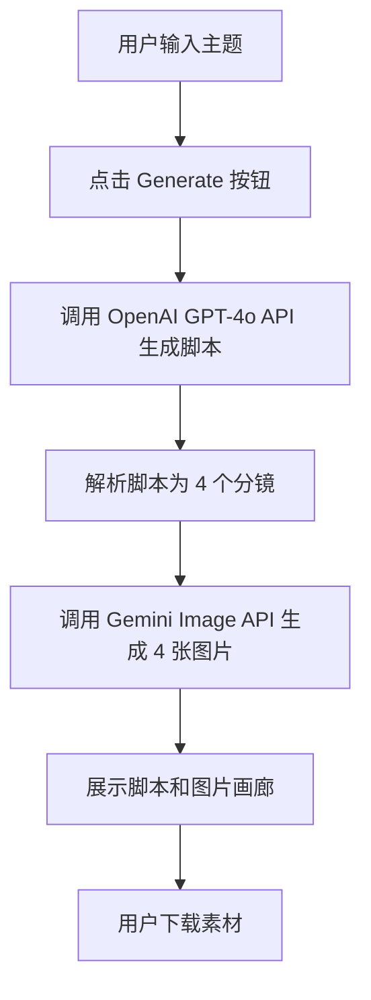

# ZenShorts AI - 产品需求文档

## 1. 产品概述

ZenShorts AI 是一款无脸视频素材生成工具，帮助内容创作者快速生成短视频素材。用户只需输入主题，系统即可自动生成 30 秒英文脚本和 4 张 AI 生成的高清图片，适配 TikTok/YouTube Shorts 等平台。

### 核心价值
- 大幅缩短短视频制作周期
- 无需露脸，降低创作门槛
- AI 驱动的创意生成，降低内容生产成本

## 2. 核心功能

### 2.1 用户角色
本产品为单用户工具，无需用户认证系统。

### 2.2 功能模块
1. **首页/主界面**: 主题输入 → 素材生成 → 结果展示
2. **生成引擎**: AI 脚本生成 + AI 图片生成

### 2.3 页面详情

| 页面名称 | 模块名称 | 功能描述 |
|---------|---------|---------|
| 主界面 | 输入区域 | 主题输入框、Generate 按钮 |
| 主界面 | 结果展示 | 脚本显示区域、4 张图片画廊 |
| 主界面 | 下载功能 | 批量下载脚本和图片 |

## 3. 核心流程

### 3.1 用户主流程

用户输入主题 → 点击生成 → 显示加载状态 → 展示脚本和图片 → 下载素材



### 3.2 API 集成流程

```
Frontend (Next.js)
    ↓
    ├→ OpenAI GPT-4o API
    │   └→ 生成 30 秒英文脚本，拆分为 4 个分镜
    │       ├→ narration: 旁白文本
    │       ├→ image_prompt: 图片生成提示词
    │       └→ duration: 时长（秒）
    │
    └→ Google Gemini 2.5 Flash Image API (Nano Banana)
        └→ 根据 image_prompt 生成 4 张 1024x1024 图片
```

## 4. 用户界面设计

### 4.1 设计风格

**视觉方向**: 禅意美学 + 现代极简主义

ZenShorts 名称中的 "Zen" 启发了整体设计语言：
- 大面积留白，营造宁静感
- 柔和的渐变和阴影
- 流动的动画，模拟呼吸节奏
- 优雅的字体搭配

**色彩方案**:
- 主色: 深邃墨蓝 `#1a1a2e`
- 辅色: 禅意灰紫 `#4a4e69`
- 强调色: 日出金 `#f4a261`
- 背景: 渐变深色 `#0f0f1a` → `#1a1a2e`
- 文字: 柔白 `#e8e8e8`

**字体选择**:
- 标题: "Playfair Display" (优雅衬线)
- 正文: "Inter" (现代无衬线)
- 代码/脚本: "Fira Code" (等宽字体)

**按钮风格**:
- 圆角胶囊按钮 (border-radius: 9999px)
- 渐变背景 + 悬停发光效果
- 柔和的点击反馈动画

**布局风格**:
- 单页应用 (SPA)
- 居中布局，最大宽度 1200px
- 卡片式结果展示
- 图片画廊采用 Masonry 或网格布局

### 4.2 页面设计详情

#### 首页/主界面

| 模块名称 | UI 元素 | 动画效果 |
|---------|---------|---------|
| Hero 区域 | 品牌标题、副标题、Zen 元素图标 | 淡入 + 上滑 |
| 输入区域 | 主题输入框 (textarea) | 聚焦时边框发光 |
| 生成按钮 | Primary CTA 按钮 | 悬停缩放 + 发光 |
| 加载状态 | 进度指示器、步骤显示 | 脉冲动画 |
| 脚本展示 | 分镜卡片列表 | 依次淡入 |
| 图片画廊 | 2x2 网格布局 | 依次淡入 + 缩放 |
| 下载功能 | 下载按钮组 | 悬停高亮 |

**布局结构**:
```
┌────────────────────────────────────┐
│           ZenShorts AI             │
│      "Create Your Zen Moment"      │
├────────────────────────────────────┤
│  ┌──────────────────────────────┐   │
│  │    输入你的视频主题...        │   │
│  └──────────────────────────────┘   │
│         [ Generate 🎬 ]            │
├────────────────────────────────────┤
│  📜 生成的脚本                      │
│  ┌─ 分镜 1 ─┐ ┌─ 分镜 2 ─┐         │
│  │ Narration│ │ Narration│         │
│  │ Duration │ │ Duration │         │
│  └──────────┘ └──────────┘         │
├────────────────────────────────────┤
│  🖼️ 生成的图片                      │
│  ┌────┐ ┌────┐                      │
│  │    │ │    │                      │
│  └────┘ └────┘                      │
│  ┌────┐ ┌────┐                      │
│  │    │ │    │                      │
│  └────┘ └────┘                      │
│       [ Download All ]              │
└────────────────────────────────────┘
```

### 4.3 响应式设计

- **桌面端 (≥1024px)**: 2x2 图片网格，侧边栏参数
- **平板端 (768-1023px)**: 2x2 图片网格，堆叠布局
- **移动端 (<768px)**: 单列布局，全宽图片

## 5. 脚本结构规范

### 5.1 脚本格式

生成的脚本必须符合以下 JSON 结构：

```typescript
interface Scene {
  scene_number: number;      // 场景编号 (1-4)
  narration: string;          // 英文旁白文本 (约 7-8 秒)
  image_prompt: string;      // 图片生成提示词
  duration: number;          // 持续时间（秒），约 7-8 秒
}

interface Script {
  topic: string;             // 用户输入的主题
  total_duration: number;    // 总时长（30 秒）
  scenes: Scene[];           // 4 个分镜
}
```

### 5.2 GPT-4o Prompt 模板

```
Create a 30-second English narration script for a faceless video, 
split into exactly 4 scenes. Each scene should be 7-8 seconds long.

Topic: {user_input}

Requirements:
- Include emotional hooks in the opening
- Suitable for TikTok/YouTube Shorts
- Cinematic and zen aesthetic
- Each scene needs: narration, image_prompt, duration

Output format: JSON
```

## 6. 图片生成规范

### 6.1 图片规格

- **分辨率**: 1024x1024 像素
- **比例**: 1:1 正方形
- **格式**: PNG
- **风格**: 高清、电影感、禅意美学

### 6.2 图片提示词模板

每个分镜的 `image_prompt` 应该:
- 描述具体的视觉场景
- 包含艺术风格关键词 (cinematic, misty, zen, ethereal)
- 强调氛围和情绪
- 使用英文描述

示例:
```
Misty mountain peaks at sunrise, soft golden light 
piercing through clouds, zen aesthetic, cinematic 
composition, 8K photography, peaceful atmosphere
```

## 7. 数据流程

### 7.1 状态管理

```typescript
interface AppState {
  // 输入状态
  topic: string;
  
  // 生成状态
  isLoading: boolean;
  currentStep: 'idle' | 'script' | 'images' | 'complete';
  error: string | null;
  
  // 结果数据
  script: Script | null;
  images: string[];  // Base64 或 URL
}
```

### 7.2 错误处理

| 错误类型 | 用户提示 | 处理方式 |
|---------|---------|---------|
| API 限流 | "请求过于频繁，请稍后再试" | 指数退避重试 |
| 网络错误 | "网络连接失败，请检查网络" | 显示重试按钮 |
| 生成失败 | "生成失败，请尝试其他主题" | 清空结果，允许重试 |
| 无效输入 | "请输入有效的视频主题" | 输入框验证 |

## 8. MVP 功能范围

### 8.1 包含功能

✅ 主题输入框
✅ Generate 按钮
✅ 脚本生成（GPT-4o）
✅ 4 张图片生成（Gemini）
✅ 脚本展示
✅ 图片画廊展示
✅ 下载功能

### 8.2 排除功能（第一阶段）

❌ 用户认证
❌ 数据库存储
❌ 历史记录
❌ 批量生成
❌ 社交分享
❌ 高级自定义选项

## 9. 验收标准

### 9.1 功能验收

- [ ] 用户可以输入视频主题
- [ ] 点击 Generate 后显示加载状态
- [ ] 成功生成 4 个分镜的脚本
- [ ] 成功生成 4 张 1024x1024 图片
- [ ] 脚本和图片正确展示
- [ ] 下载按钮可以正常下载素材

### 9.2 视觉验收

- [ ] 页面加载流畅，无明显卡顿
- [ ] 动画效果自然，不影响用户体验
- [ ] 响应式布局在各种屏幕尺寸下正常
- [ ] 色彩搭配协调，符合禅意美学
- [ ] 字体显示清晰，层次分明

### 9.3 性能验收

- [ ] 首屏加载时间 < 3 秒
- [ ] 图片生成时间 < 30 秒
- [ ] 页面交互响应 < 100ms
- [ ] 无内存泄漏
